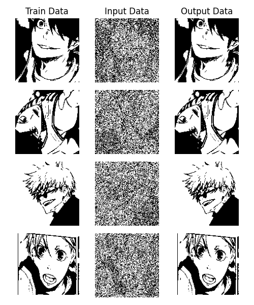

# hopfield-neural-network
Python implementation of the Hopfield Neural Network, supporting both asynchronous and synchronous updates.  
Train the network using either image data (`train_img.py`) or numerical matrix values (`train_test.py`).


## Installation
Python **≥ 3.5** must be installed. You can install all dependencies using:

```bash
pip install -r requirements.txt
```

## Training with Images (`train_img.py`)
This script trains and tests the Hopfield Network with the image file input.
<br>

#### Demo
The following demo is the result of using Synchronous update.
```bash
Data Processing ...
Training Patterns ... 
100%|█████████████████████████████████████████████████████████████████████████████████████████████████████████| 4/4 [00:10<00:00,  2.57s/it]
Predicting Pattern ... 
100%|█████████████████████████████████████████████████████████████████████████████████████████████████████████| 4/4 [00:09<00:00,  2.41s/it]
Show Prediction Results ...
```


<br>

#### Steps to Run

1. Add images to `train_img` directory

2. Adjust the seed value if necessary
    ```python
    np.random.seed(523)
    ```

3. Run `train_img.py` script
    ```bash
    python train_img.py
    ```

4. View the result, also saved in `result/result.png`


## Training with Matrix Patterns
This script trains and tests the Hopfield Network with the bipolar matrix input (2D arrays).
<br>

#### Demo
The following demo is the result of using both Synchronous/Asynchronous update.

<br>

**Training**

```bash
Training Patterns ... 
100%|█████████████████████████████████████████████████████████████████████████████████████████████████████████████████████████████████████████████████████████████████| 2/2 [00:00<00:00, 13315.25it/s]
Training Completed.
╒════╤════╤════╤════╤════╕
│  1 │ -1 │  1 │ -1 │  1 │
├────┼────┼────┼────┼────┤
│ -1 │  1 │ -1 │  1 │ -1 │
╘════╧════╧════╧════╧════╛
```

<br>

Synchornous

```bash
Input Pattern:
+----+----+----+----+----+
|  1 |  1 |  1 | -1 |  1 |
+----+----+----+----+----+
|  1 |  1 |  1 |  1 | -1 |
+----+----+----+----+----+
|  1 | -1 |  1 |  1 | -1 |
+----+----+----+----+----+
| -1 |  1 | -1 |  1 | -1 |
+----+----+----+----+----+
|  1 |  1 |  1 |  1 | -1 |
+----+----+----+----+----+

Predicting Pattern ... 
100%|██████████████████████████████████████████████████████████████████████████████████████████████████████████████████████████████████████████████████████████████████| 5/5 [00:00<00:00, 8741.78it/s]

Trained Pattern:
┏━━━━┳━━━━┳━━━━┳━━━━┳━━━━┓
┃  1 ┃ -1 ┃  1 ┃ -1 ┃  1 ┃
┣━━━━╋━━━━╋━━━━╋━━━━╋━━━━┫
┃ -1 ┃  1 ┃ -1 ┃  1 ┃ -1 ┃
┗━━━━┻━━━━┻━━━━┻━━━━┻━━━━┛

Predicted Pattern (sync): 
╒════╤════╤════╤════╤════╕
│  1 │ -1 │  1 │ -1 │  1 │
├────┼────┼────┼────┼────┤
│ -1 │  1 │ -1 │  1 │ -1 │
├────┼────┼────┼────┼────┤
│  1 │ -1 │  1 │ -1 │  1 │
├────┼────┼────┼────┼────┤
│ -1 │  1 │ -1 │  1 │ -1 │
├────┼────┼────┼────┼────┤
│ -1 │  1 │ -1 │  1 │ -1 │
╘════╧════╧════╧════╧════╛
```

<br>

Asynchornous

```bash
Input Pattern:
+----+----+----+----+----+
| -1 |  1 | -1 | -1 |  1 |
+----+----+----+----+----+
|  1 |  1 | -1 | -1 | -1 |
+----+----+----+----+----+
|  1 |  1 |  1 | -1 | -1 |
+----+----+----+----+----+
| -1 |  1 | -1 |  1 | -1 |
+----+----+----+----+----+
| -1 | -1 | -1 | -1 |  1 |
+----+----+----+----+----+

Predicting Pattern ... 
100%|███████████████████████████████████████████████████████████████████████████████████████████████████████| 5/5 [00:00<00:00, 2411.07it/s]

Trained Pattern:
┏━━━━┳━━━━┳━━━━┳━━━━┳━━━━┓
┃  1 ┃ -1 ┃  1 ┃ -1 ┃  1 ┃
┣━━━━╋━━━━╋━━━━╋━━━━╋━━━━┫
┃ -1 ┃  1 ┃ -1 ┃  1 ┃ -1 ┃
┗━━━━┻━━━━┻━━━━┻━━━━┻━━━━┛

Predicted Pattern (async): 
╒════╤════╤════╤════╤════╕
│  1 │ -1 │  1 │ -1 │  1 │
├────┼────┼────┼────┼────┤
│ -1 │  1 │ -1 │  1 │ -1 │
├────┼────┼────┼────┼────┤
│  1 │ -1 │  1 │ -1 │  1 │
├────┼────┼────┼────┼────┤
│ -1 │  1 │ -1 │  1 │ -1 │
├────┼────┼────┼────┼────┤
│ -1 │  1 │ -1 │  1 │ -1 │
╘════╧════╧════╧════╧════╛
```

#### Steps to Run

1. Set network size. This is the number of neurons in 1 pattern.
    ```python
    network_size = 5
    ```

2. Set the patterns to be trained by the network. The length of each array must equal to the `network_size`
    ```python
    patterns = [
        [1, -1, 1, -1, 1],
        [-1, 1, -1, 1, -1]
    ]
    ```

3. Call `testing(fn, n)` function. Pass in the function (`sync_testing`/`async_testing`) and the number of test patterns you want to generate.
    ```python
    testing(sync_testing, 5)
    testing(async_testing, 5)
    ```

4. Run `train_test.py` script
    ```bash
    python train_test.py
    ```

4. View the output result in terminal.
